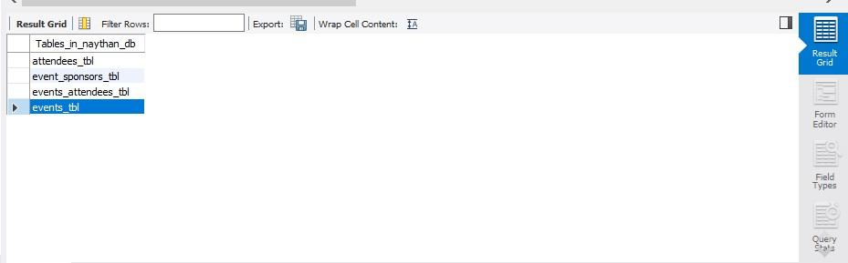
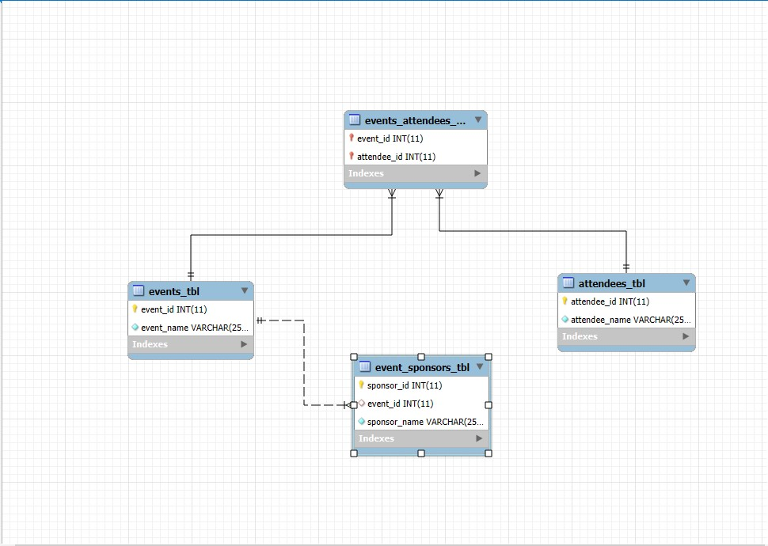

# Finals Lab Task 1 - Events Management DB

## Create Database:
We first create the database Naythan_DB if it doesn't already exist.
Create events_tbl:
This table holds events with an event_id as the primary key and event_name.

## Create attendees_tbl:

This table holds attendees with an attendee_id as the primary key and attendee_name.

## Create events_attendees_tbl:

This table links events_tbl and attendees_tbl using a many-to-many relationship.

It uses event_id and attendee_id as foreign keys.

## Create event_sponsors_tbl:

This table links sponsors to events with the event_id and sponsor_name.

## STEP 2 - Here's the screenshot of my output tables (See screenshot)

 

[*Here's the raw file*](https://github.com/NaythanIsME/EDM-Portfolio/blob/main/Finals%20Task%201/Files/naytheen.sql)

## STEP 3 - Here's the screenshot of my output ERD (See screenshot)

 

[*Here's the raw file*](https://github.com/NaythanIsME/EDM-Portfolio/blob/main/Finals%20Task%201/Files/naythan.mwb)
