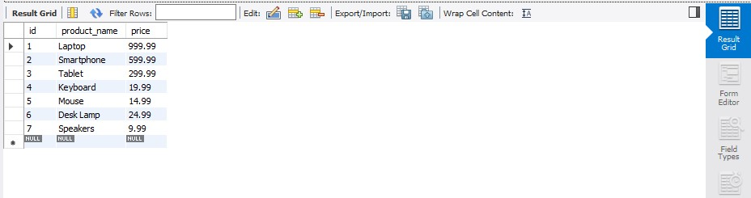

# 🛠️ Finals Task 3 – Table Manipulation

## ✅ Task 1 – Query Statements

SELECT * FROM products_tbl;

DESCRIBE products_tbl;

## 🏗️ Task 2 – Table Structure

CREATE DATABASE products_db;
USE products_db;

CREATE TABLE products_tbl (
    id INT AUTO_INCREMENT PRIMARY KEY,
    product_name VARCHAR(100) NOT NULL,
    price DECIMAL(10, 2)
);

ALTER TABLE products_tbl
ADD CONSTRAINT chk_price CHECK (price > 0);

INSERT INTO products_tbl (product_name, price)
VALUES
    ('Laptop', 999.99),
    ('Smartphone', 599.99),
    ('Tablet', 299.99),
    ('Keyboard', 19.99),
    ('Mouse', 14.99),
    ('Desk Lamp', 24.99),
    ('Speakers', 9.99);

ALTER TABLE products_tbl
MODIFY COLUMN product_name VARCHAR(120) NOT NULL;

## 🗺️ Task 3 – Relational Schema for Products Table

 

## 📄 Task 4 – SQL Copy of the Database and Table Structures

[Raw Copy of MySQL File](https://github.com/NaythanIsME/EDM-Portfolio/blob/main/Finals%20Task%203/Files/naythan_products.sql)

```sql
CREATE DATABASE products_db;
USE products_db;

CREATE TABLE products_tbl (
    id INT AUTO_INCREMENT PRIMARY KEY,
    product_name VARCHAR(100) NOT NULL,
    price DECIMAL(10, 2)
);

ALTER TABLE products_tbl
ADD CONSTRAINT chk_price CHECK (price > 0);

INSERT INTO products_tbl (product_name, price)
VALUES
    ('Laptop', 999.99),
    ('Smartphone', 599.99),
    ('Tablet', 299.99),
    ('Keyboard', 19.99),
    ('Mouse', 14.99),
    ('Desk Lamp', 24.99),
    ('Speakers', 9.99);

ALTER TABLE products_tbl
MODIFY COLUMN product_name VARCHAR(120) NOT NULL;

SELECT * FROM products_tbl;

DESCRIBE products_tbl;
