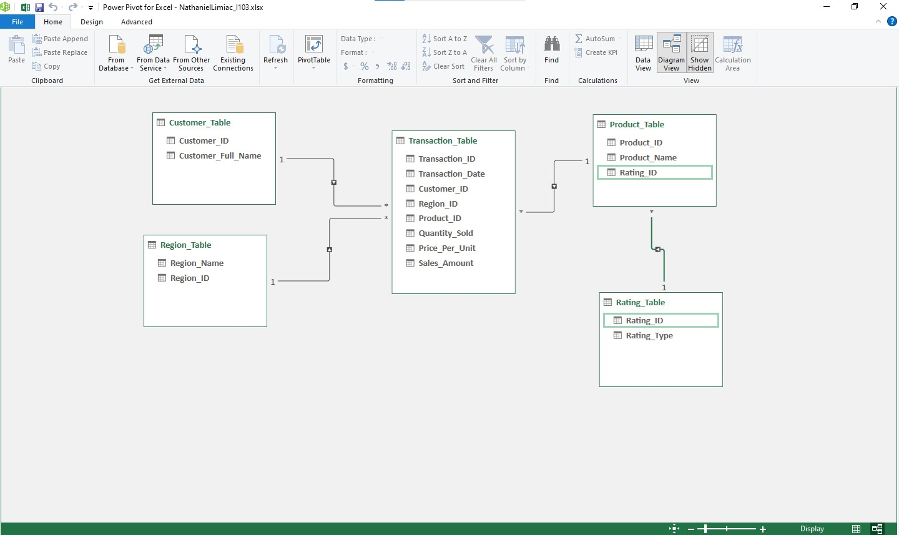

# Midterm Lab Task 1 - Data Cleaning and Preparation using Excel

For this task, we are given flat data from Excel (See raw file) and tasked with performing Data Cleaning and Preparation.

## STEP 1 - Data Cleaning Process

### 1. **Load Raw File**
- **Action**: Import the raw data from the given Excel file into a new Excel workbook.
- **Tools**: Excel, Python (pandas), or any other ETL tool.

### 2. **Fit Column and Row Width/Height**
- **Action**: Adjust the column and row sizes to make the data easier to read.
- **Method**: Use Excel's auto-fit feature or the "Format" option for row and column resizing.

### 3. **Trim Extra Spaces**
- **Action**: Use Excel's `TRIM()` function or Python `pandas` library to remove extra spaces from data entries.
- **Steps**:
  - Identify columns with inconsistent spaces.
  - Apply `TRIM()` to remove leading and trailing spaces.

### 4. **Remove NULL Values**
- **Action**: Delete rows or replace NULL values with a default value (e.g., "N/A", 0, etc.).
- **Method**:
  - In Excel, filter out or delete rows with NULL values.
  - In Python, use `.dropna()` or `.fillna()`.

### 5. **Remove Duplicates**
- **Action**: Check for duplicate records and remove them.
- **Method**:
  - In Excel, use the "Remove Duplicates" feature.
  - In Python, use `.drop_duplicates()`.

---

## STEP 2 - Normalization

### **1NF (First Normal Form)**:
- **Action**: Ensure that the data is in atomic form (no multiple values in a single column).
- **Steps**:
  - Identify columns with multiple values and separate them into distinct columns or rows.
  - Example: If you have a column for "Products Purchased" with multiple values, split it into multiple rows.

### **2NF (Second Normal Form)**:
- **Action**: Remove partial dependencies (columns that depend on only part of the primary key).
- **Steps**:
  - Identify tables where non-key attributes depend only on part of the primary key.
  - Split such columns into new tables.
  - Example: If a table contains customer information along with the product they purchased, split the table into "Customers" and "Products."

### **3NF (Third Normal Form)**:
- **Action**: Remove transitive dependencies (non-key columns depending on other non-key columns).
- **Steps**:
  - Identify and remove columns that depend on other non-key columns.
  - Example: If you have a column "Customer Address" in a "Product" table, move it to a separate "Customer" table.

---

## STEP 3 - Physical Data Model

### **Action**: Create a Physical Data Model (PDM) that represents the final normalized database design.
- **Steps**:
  - Identify primary keys (PK) and foreign keys (FK).
  - Define relationships between tables (one-to-one, one-to-many, etc.).
  - Create entity relationship diagrams (ERD) to visualize how the tables are connected.

---

## STEP 4 - Files

### **Raw Data File:**
[Here's the raw file](https://github.com/NaythanIsME/EDM-Portfolio/blob/main/Midterm%20Task%201/Files/ways_to_clean_dataRaw.xlsx)

### **Cleaned Data File:**
[Here's the cleaned file](https://github.com/NaythanIsME/EDM-Portfolio/blob/main/Midterm%20Task%201/Files/NathanielLimiac_I103.xlsx)

---

### **Screenshots:**

#### Before Data Cleaning:

#### After Data Cleaning:

#### Physical Data Model:

