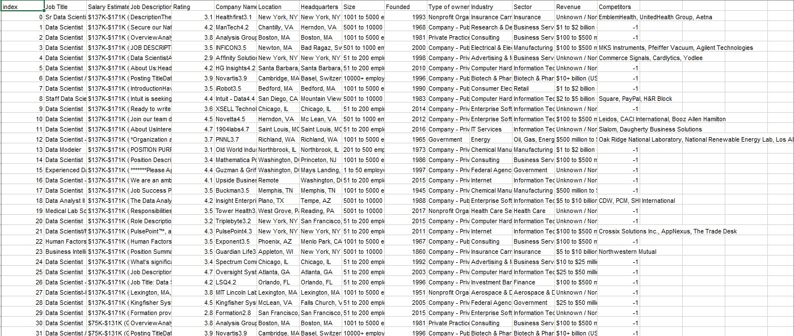

# Midterm Lab Task 2 – Data Cleaning and Transformation Using Power Query Editor

For this task, we are provided with an Uncleaned_DS_jobs.csv dataset (from Kaggle) and tasked with performing data cleaning and transformation using Power Query Editor in Excel to generate meaningful insights.

## STEP 1 – Data Cleaning Process

### 1. **Load the Raw File**
- **Action**: Import the raw dataset into Power Query Editor in Excel.
- **Tools**: Power Query Editor in Excel.

### 2. **Fit Column and Row Width/Height**
- **Action**: Adjust column and row sizes to ensure the data is properly readable.
- **Method**: Use Excel’s auto-fit feature for columns and rows.

### 3. **Trim Extra Spaces**
- **Action**: Remove extra spaces from data entries using Power Query’s `Trim` function.
- **Method**: Use the `Transform` tab in Power Query and select the `Trim` option.

### 4. **Remove NULL Values**
- **Action**: Filter out or remove rows with NULL values.
- **Method**: Filter out NULL values by selecting the relevant column and applying a filter.

### 5. **Remove Duplicates**
- **Action**: Identify and remove any duplicate records in the dataset.
- **Method**: Use Power Query's "Remove Duplicates" feature from the `Home` tab.

---

## STEP 2 – Data Transformation

### 1. **Salary Estimate Column:**
- **Action**: In Power Query, select the Salary Estimate column and use `Transform > Extract > Text Before Delimiter` to remove any characters after the open parenthesis.
- **Steps**: 
  - Extract the numeric salary value before the parenthesis to create cleaner salary data.

### 2. **Create Min and Max Salary Columns:**
- **Action**: Use `Add Column > Column from Examples` to generate the Min Salary and Max Salary columns from the Salary Estimate column.
- **Steps**:
  - Create two new columns for minimum and maximum salary values.

### 3. **Add Role Type Column:**
- **Action**: Go to `Add Column > Custom Column` and use a formula to categorize job titles into roles like Data Scientist, Data Analyst, Data Engineer, etc.
- **Steps**:
  - Categorize job titles by role type using conditional logic.

### 4. **Split Location Column:**
- **Action**: Select the Location column and use `Transform > Split Column by Delimiter (Comma)` to split the location into separate columns.
- **Steps**:
  - Split the location into separate columns, such as "City" and "State".

### 5. **Location Correction:**
- **Action**: Create a custom column to correct location values by replacing certain locations (e.g., "New Jersey" to ", NJ", "California" to ", CA").
- **Steps**:
  - Use the `Add Column > Custom Column` option to create a new location format.

### 6. **Handle Negative Values:**
- **Action**: Filter out negative values in the Competitors and Industry columns.
- **Method**: Apply filters in Power Query to remove negative numbers from these columns.

### 7. **Clean Company Name:**
- **Action**: Remove unwanted text from the Company Name column using `Transform > Replace Values` or `Remove Text`.
- **Steps**:
  - Clean up company names by replacing or removing unwanted text.

---

## STEP 3 – Screenshots

### Before Data Cleaning:
(See screenshot of raw data before any transformations were made.)

[**Here’s the raw file**](https://github.com/NaythanIsME/EDM-Portfolio/blob/main/Midterm%20Task%202/Files/Uncleaned_DS_jobs.xlsx)

### After Data Cleaning:
(See screenshot of cleaned data post-transformation.)

[**Here’s the cleaned file**](https://github.com/NaythanIsME/EDM-Portfolio/blob/main/Midterm%20Task%202/Files/NathanielLimiac_task2.xlsx)

---

## STEP 4 – Final Output Queries

Here are the final queries after performing all necessary data transformations:

### 1. **Sal By Role Type dup**:
A query with job titles categorized by role type.

### 2. **Sal By Size ref**:
A query focusing on salary data by company size or another metric.

### 3. **Sal By State ref**:
A query analyzing salary data by state/location.

### 4. **Uncleaned DS Jobs**:
The original dataset before any transformations.

---

## Physical Data Model
(Insert physical data model screenshot here)

