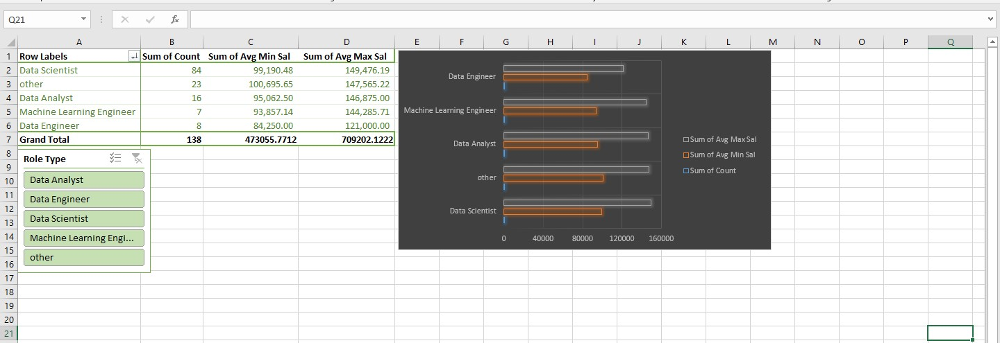
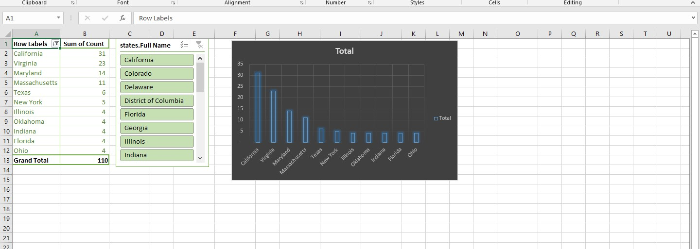
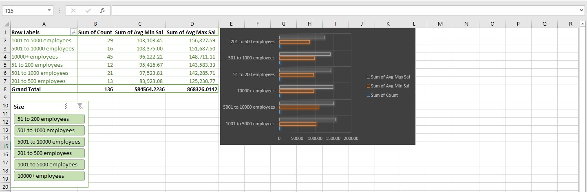
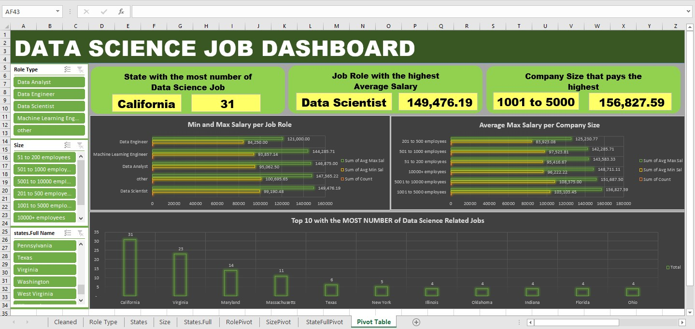
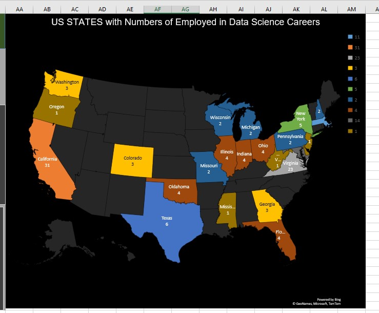

# Midterm Lab Task 3: Creating PIVOT TABLE and DASHBOARD

This task focuses on building a Dashboard with the necessary Pivot Tables, charts, and interactivity using slicers. Below are the detailed steps for creating the Pivot Tables and the Dashboard:

## Step 1: Data Preparation

### 1. **Load Data**
- Open the worksheet for **Uncleaned DS Jobs** and transform the necessary tables into Pivot Tables.

---

## Step 2: Pivot Table Creation

### **Sal by Role:**
- Create a Pivot Table to display salary data categorized by role.

### **Sal by State:**
- Create a Pivot Table to display salary data categorized by state.

### **Sal by Size:**
- Create a Pivot Table to display salary data categorized by company size.

---

## Step 3: Design Your Dashboard

### **Insert Charts:**

- **Salary by Role Chart**: 
  - Select your PivotTable for Salary by Role, and then go to `Insert > Recommended Charts`. Choose a **Bar Chart** or **Column Chart** for this.
- **Salary by State Chart**: 
  - Similarly, select the PivotTable for Salary by State and insert a **Bar Chart** or **Column Chart**.
- **Salary by Size Chart**: 
  - Use a **Pie Chart** or **Bar Chart** for visualizing Salary by Size.

### **Map Chart:**

- If you want to use a **Map Chart** for Salary by State:
  - Select the State and Salary data from your PivotTable.
  - Then go to `Insert > Maps > Filled Map`.
  - Ensure that your state names are recognized by Excel for map generation.

---

## Step 4: Insert Slicers for Interactivity

### **Insert Slicers:**

- Select a PivotTable (e.g., Salary by Role) and go to `Insert > Slicer`.
- Choose the fields you want to filter by, such as **State**, **Size**, or **Role**.
- Repeat this process for other PivotTables as needed.

---

## Step 5: Apply Design and Color Customizations

- **Color Customization**: 
  - Go to `Home → Cell Styles` or manually color chart elements to match your desired color scheme.
- **Chart Design**:
  - Select the chart → `Chart Tools → Design` to apply design customizations.

---

## Step 6: Make the Dashboard Interactive

### **Connect Slicers:**

- Right-click on a slicer → `Report Connections` → select all relevant PivotTables.

### **Test Interactivity:**

- Click slicer options and verify that filtering updates the dashboard accordingly.

---

## Step 7: Insert Dashboard

Here’s a screenshot of the final dashboard that includes all Pivot Tables and charts.

---

## Step 8: Insert Map

This is the map chart showing salary data by state.

---

## Final File

[**Here’s the file**](https://github.com/NaythanIsME/EDM-Portfolio/blob/main/Midterm%20Task%203/Files/NathanielLimiacPivot.xlsx)
